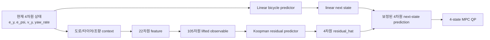

# EDMD-Koopman Residual MPC Notes

이 저장소는 `VehicleBody + ECorner + Fiala tire` plant를 대상으로 한
EDMD-Koopman 기반 경로 추종 MPC 연구 설명을 정리한 문서 저장소입니다.

핵심 아이디어는 간단합니다.

> Linear bicycle model이 미래 차량 거동을 기본 예측하고, EDMD-Koopman residual model이 그 예측이 틀릴 부분을 보정한다.

## 연구 구조

## 문서

- [Koopman MPC 쉬운 설명](docs/koopman_mpc_explanation.md)
- [교수님 질문 대응 Q&A](docs/professor_qa.md)

## 한 줄 요약

MPC가 직접 푸는 문제는 여전히 4차원 상태 기반이지만, 그 전에 Koopman 모델이 105차원 lifted observable을 사용해 linear model의 예측 오차를 미리 보정한다.

